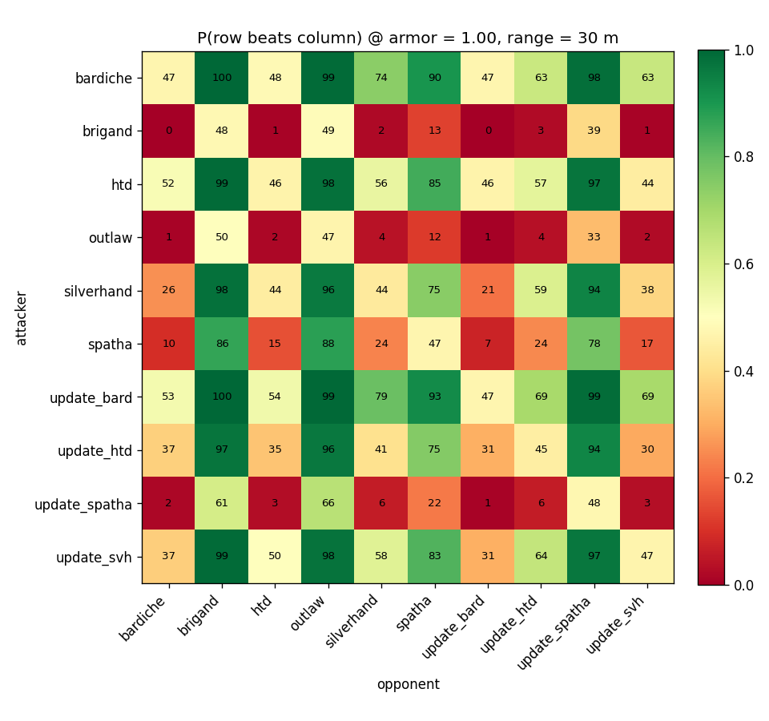

# Foxhole Armor Duels

A probabilistic look at 1v1 tank matchups.

[Open the interactive simulator →](index.html)

<p class="small">Use ←/→ to navigate.</p>

---

## What the model is

- **Deterministic expansion of a probability tree** over discrete hit counts.
- *Not* Monte Carlo — no sampling, results are exact up to a pruning cutoff (`1e-12`).
- State per branch: `(hits1, hits2)`, generalized to nested tuples once a tank carries multiple weapons.
- Each shot event branches every live state into 2 outcomes (one shooter) or 4 (simultaneous fire), weighted by per-state penetration probability.

---

## Penetration formula

For a given (defender, attacking weapon, range):

```
S  = 1 − armor_fraction
P  = pen_mod · clamp(S, P0, S0) + range_bonus
P  = clamp(P, 0, 1)
```

- `P0` and `S0` are the defender's `base_pen_chance` and `pre_bonus_cap`.
- `pen_mod` is the attacking weapon's multiplier.
- `range_bonus` is a step function: ≤5 m → +0.25, ≤10 m → +0.20, ≤20 m → +0.10, else 0.

---

## Firing schedule

Each weapon fires independently:

```
shot_time(n) = (n − 1)·fire_cooldown
             + max(0, n − ammo_capacity)·reload_time
```

- `ammo_capacity` is the pre-loaded burst before the first reload.
- Schedules from both tanks are merged. Shots within `1e-9 s` resolve as one 4-way simultaneous branch using **pre-shot** armor for both rolls.

---

## Win-rate matrix &mdash; full armor



<p class="small">P(row tank beats column tank), range 30 m, both at full armor.</p>

---

## Matrix evolution &mdash; armor 0 → 1

<video src="assets/matrix_evolution.mp4" autoplay loop muted playsinline controls
       poster="assets/matrix_frames/matrix_20.png">
  Your browser does not support inline video.
  <a href="assets/matrix_evolution.gif">Animated GIF fallback</a>.
</video>

<p class="small">Both tanks share the same armor fraction; sweep is 0.00 → 1.00 in 0.05 steps.</p>

---

## Takeaways

- *(Fill in after rendering — the most surprising matchups and any sharp armor-threshold flips.)*
- Asymmetric matchups, custom ranges, and the weapon-disable mode are all available in the live simulator.

---

## Try it yourself

The interactive page lets you pick any two tanks at any armor fractions and range, and runs the same Python (via Pyodide) directly in your browser.

[Launch the simulator →](index.html)
